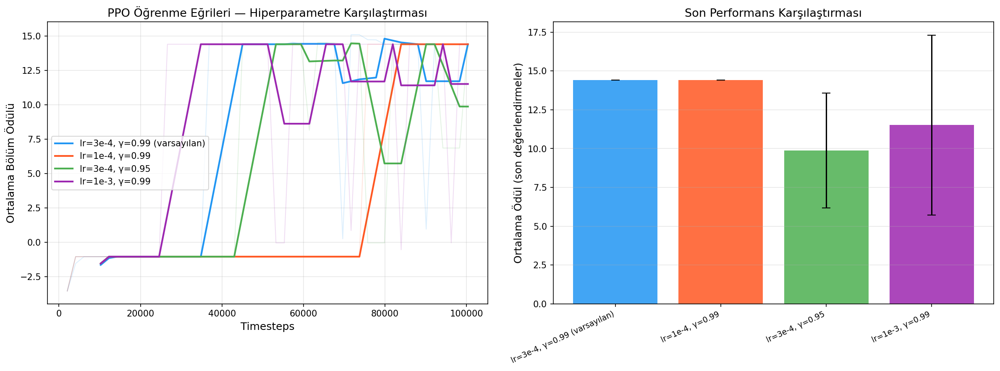

# YZR502 Ödev 0801 — Mobil Robot Navigasyonu için Takviyeli Öğrenme ile Hiperparametre Analizi

**Ders:** YZR502 Robotik Sistemler ve Algoritmalar  
**Öğrenci:** [Ad Soyad]  
**E-posta:** [ogrenci@kurum.edu.tr]  
**ORCID:** [0000-0000-0000-0000]  
**YouTube:** [https://youtu.be/XXXXXXXXXX]  

---

## Proje Özeti

Bu çalışmada MiniGrid-Empty-8x8-v0 simülasyon ortamında bir mobil robotun navigasyon görevini öğrenmesi için **PPO (Proximal Policy Optimization)** algoritması kullanılmış; dört farklı hiperparametre konfigürasyonunun öğrenme performansına etkisi karşılaştırmalı olarak incelenmiştir.

---

## Deney Konfigürasyonları

| Deney | Learning Rate | Gamma | Açıklama |
|-------|--------------|-------|----------|
| D1 | 3×10⁻⁴ | 0.99 | Baseline — varsayılan PPO |
| D2 | 1×10⁻⁴ | 0.99 | Düşük öğrenme oranı |
| D3 | 3×10⁻⁴ | 0.95 | Düşük indirim faktörü |
| D4 | 1×10⁻³ | 0.99 | Yüksek öğrenme oranı |

**Sabit parametreler:** n_steps=2048, batch_size=128, n_epochs=10, ent_coef=0.01, seed=42, total_timesteps=100 000

---

## Sonuç Özeti

| Deney | Başarı (%) | Ort. Ödül | Yakınsama |
|-------|-----------|-----------|-----------|
| D1: lr=3e-4, γ=0.99 | %100 | 14.40 | ~30 000 adım — en dengeli |
| D2: lr=1e-4, γ=0.99 | %100 | 14.40 | ~75 000 adım — en yavaş |
| D3: lr=3e-4, γ=0.95 | %100 | 14.39 | ~35 000 adım — dalgalı |
| D4: lr=1e-3, γ=0.99 | %100 | 14.40 | ~40 000 adım — stabil değil |

Tüm konfigürasyonlar %100 başarıya ulaşmıştır. Asıl fark **yakınsama hızı** ve **politika stabilitesi** üzerinde gözlemlenmiştir. D1 en dengeli öğrenme profilini sergilemiş ve önerilen konfigürasyon olarak belirlenmiştir.



---

## Repo İçeriği

```
├── YZR502_Odev0801_RL_Navigasyon_v2.ipynb   # Tamamlanmış Colab notebook
├── ogrenme_egrileri_karsilastirma.png        # Öğrenme eğrisi grafiği
├── logs/
│   ├── deney1_lr3e4_g099/best_model/        # D1 en iyi model (.zip)
│   ├── deney2_lr1e4_g099/best_model/        # D2 en iyi model (.zip)
│   ├── deney3_lr3e4_g095/best_model/        # D3 en iyi model (.zip)
│   └── deney4_lr1e3_g099/best_model/        # D4 en iyi model (.zip)
└── videos/
    └── best_deney1_lr3e4_g099-*.mp4         # Eğitilmiş robotun navigasyon videosu
```

---

## Nasıl Çalıştırılır

1. [Google Colab](https://colab.research.google.com) adresine gidin
2. `YZR502_Odev0801_RL_Navigasyon_v2.ipynb` dosyasını yükleyin
3. Hücreleri sırayla çalıştırın — yerel kurulum gerekmez

---

## Teknik Altyapı

- **Ortam:** MiniGrid-Empty-8x8-v0 (Farama Foundation)
- **Algoritma:** PPO — Stable-Baselines3
- **Gözlem:** FullyObsWrapper → CustomRewardWrapper → FlattenObsWrapper (193 boyutlu)
- **Ödül Şekillendirme:** Manhattan mesafesi tabanlı potansiyel-tabanlı reward shaping
- **Platform:** Google Colab (CPU)
